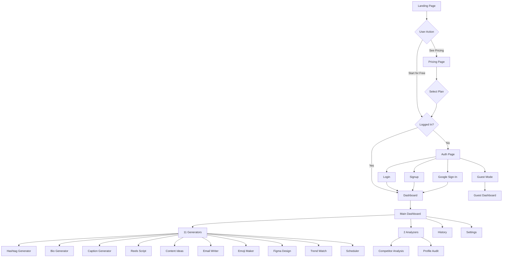
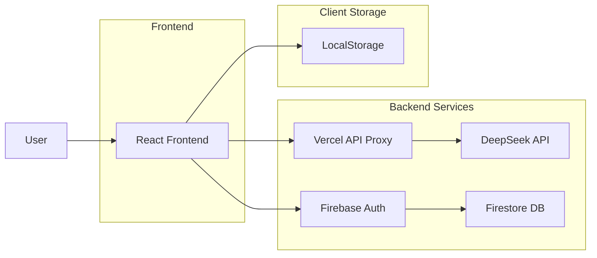
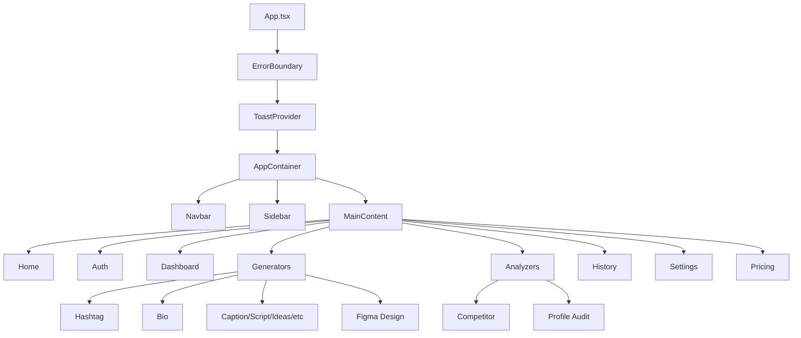
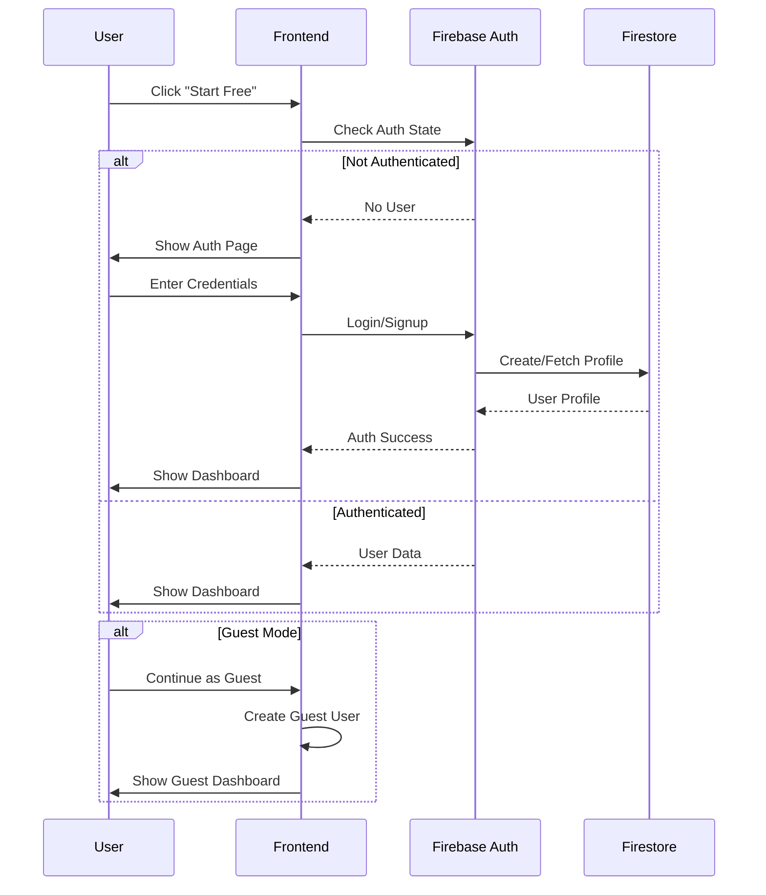
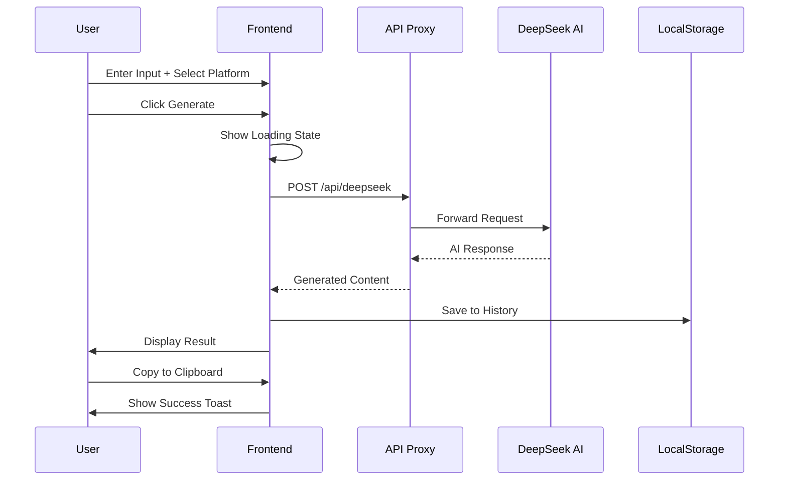
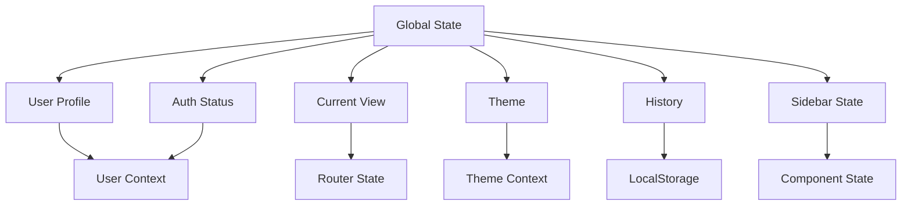
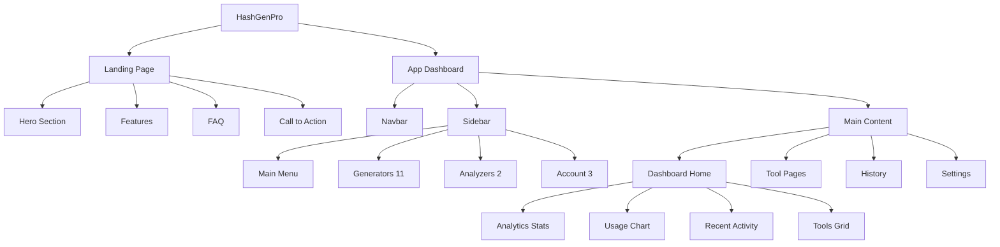
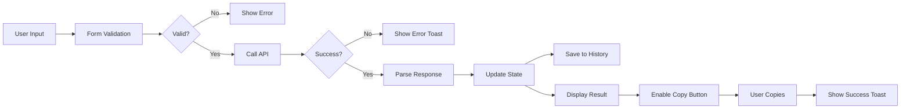
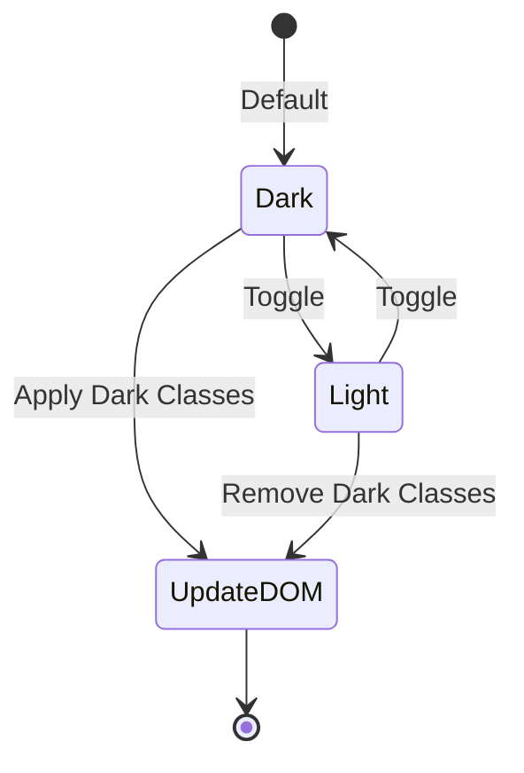
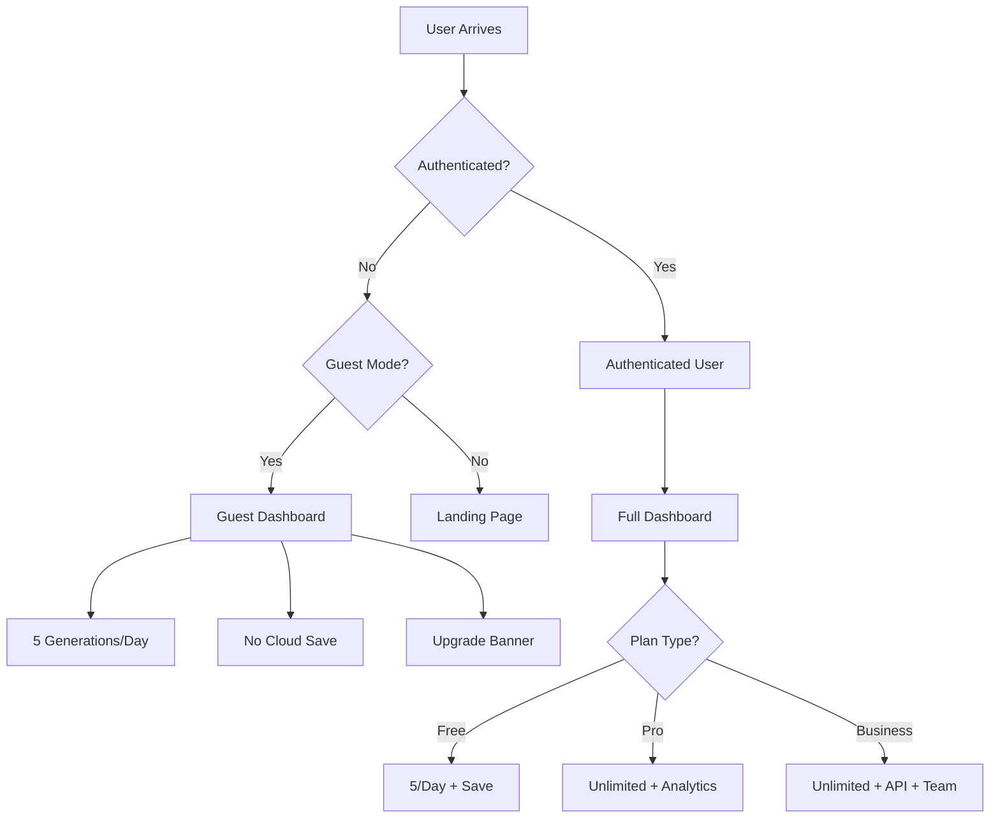

# HashGenPro - Site Flow Diagram (Mermaid)

## User Journey Flow

## Application Architecture

## Component Hierarchy

## Authentication Flow

## Generation Flow

## State Management

## Page Structure

## Data Flow

## Theme Toggle

## Guest vs Authenticated Flow

---

## How to Use in Figma

### Method 1: Import this Markdown
1. Copy the mermaid code blocks
2. Use [Mermaid Live Editor](https://mermaid.live)
3. Export as SVG
4. Import SVG into Figma

### Method 2: Manual Recreation
Use the text diagrams in `WEBSITE_ARCHITECTURE.md` as reference to:
1. Create frames for each page
2. Add components (buttons, forms, cards)
3. Connect with arrows/flows
4. Add annotations

### Method 3: Use FigJam
1. Open FigJam (Figma's whiteboard)
2. Create flowchart with shapes and connectors
3. Use sticky notes for annotations
4. Add screenshots from the website

---

**Tip:** Use the architecture document alongside these diagrams for complete context!
